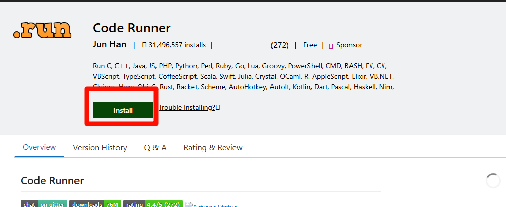

# 安装 go

## 下载 go

访问 [Go 官网](https://golang.google.cn/dl/) 下载对应系统的安装包


## 验证 go 是否安装成功

### 查看 go 版本

```shell
go version
```

### 查看 go 环境变量

```shell
go env
```

<!-- prettier-ignore -->
*[VS Code]: Visual Studio Code

## 安装 VS Code 代码编辑器

访问 [VS Code 官网](https://code.visualstudio.com/) 下载对应系统的安装包


### 汉化 VS Code

安装插件 [简体中文语言包](https://marketplace.visualstudio.com/items?itemName=MS-CEINTL.vscode-language-pack-zh-hans)


### 安装 Go 插件

安装插件 [Go](https://marketplace.visualstudio.com/items?itemName=golang.Go)


### 安装代码运行插件

安装插件 [Code Runner](https://marketplace.visualstudio.com/items?itemName=formulahendry.code-runner)



### 导入 VS Code 配置

1. 打开 VS Code
2. 使用 `Ctrl` + `,` 打开设置
3. 点击右上角的图标，打开设置 (JSON)
   
4. 复制以下内容到设置 JSON 中

   ```json
   {
     "editor.cursorBlinking": "smooth",
     "editor.cursorSmoothCaretAnimation": "on",
     "editor.fontSize": 20,
     "editor.formatOnPaste": true,
     "editor.formatOnSave": true,
     "editor.formatOnType": true,
     "editor.guides.bracketPairs": "active",
     "editor.linkedEditing": true,
     "editor.smoothScrolling": true,
     "editor.stickyTabStops": true,
     "editor.tabSize": 2,
     "files.autoSave": "onFocusChange",
     "git.autofetch": true,
     "git.confirmSync": false,
     "git.enableSmartCommit": true,
     "go.toolsManagement.autoUpdate": true,
     "terminal.integrated.smoothScrolling": true,
     "terminal.integrated.stickyScroll.enabled": true,
     "workbench.list.smoothScrolling": true,
     "terminal.integrated.cursorBlinking": true,
     "terminal.integrated.cursorStyle": "line",
     "[go]": {
       "editor.defaultFormatter": "golang.go"
     },
     "code-runner.saveFileBeforeRun": true,
     "code-runner.saveAllFilesBeforeRun": true,
     "editor.gotoLocation.multipleDefinitions": "goto",
     "chat.commandCenter.enabled": false
   }
   ```

## 开始编写代码

### 传统方式

1. 在任意位置新建一个文件夹来存放你的代码
2. 右键此文件夹，选择“通过 Code 打开”
   
3. 在 VS Code 中新建一个文件，命名为 `main.go`

   ```go
   package main

   import "fmt"

   func main() {
   	fmt.Println("Hello, World!")
   }
   ```

4. 运行代码

   ```shell
   go run main.go
   ```

5. 编译代码

   ```shell
   go build main.go # 编译生成可执行文件
   ./main # 运行可执行文件
   ```

### 新方式

1. 在任意位置新建一个文件夹来存放你的代码
2. 右键此文件夹，选择“通过 Code 打开”
   
3. 在 VS Code 中新建一个文件，命名为 `main.go`

   ```go
   package main

   import "fmt"

   func main() {
   	fmt.Println("Hello, World!")
   }
   ```

4. 运行代码（按下 `Ctrl` + `Alt` + `N`或点击 VS Code 右上角的图标）
   
