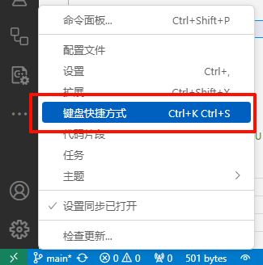

# 注释

```go
// 单行注释
// 单行注释

/*
多行注释
多行注释
*/
```

在 VS Code 中，可以使用快捷键 `Ctrl` + `/` 来快速添加或删除**单行注释**  
可以使用快捷键 `Shift` + `Alt` + `A` 来快速添加或删除**多行注释**。

::: tip 建议

可以在 VS Code 中更改键盘快捷键，将 `Shift` + `Alt` + `A` 改为 `Ctrl` + `Shift` + `/`，这样就可以使用 `Ctrl` + `Shift` + `/` 来添加或删除**多行注释**了。



:::
