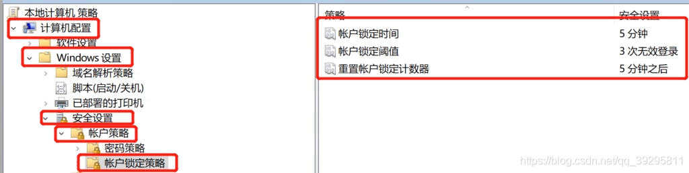
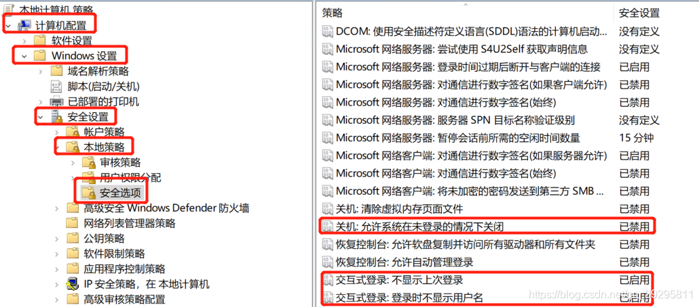
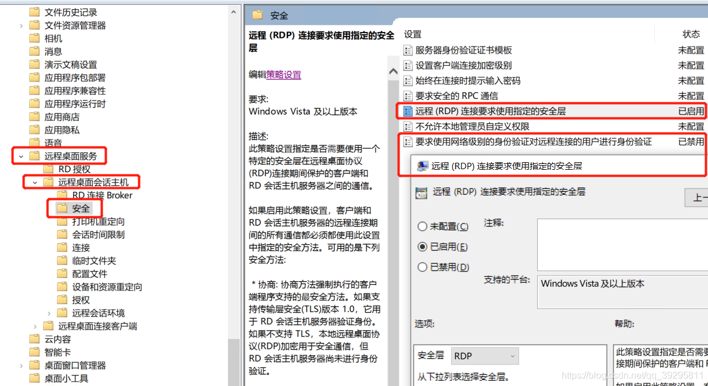
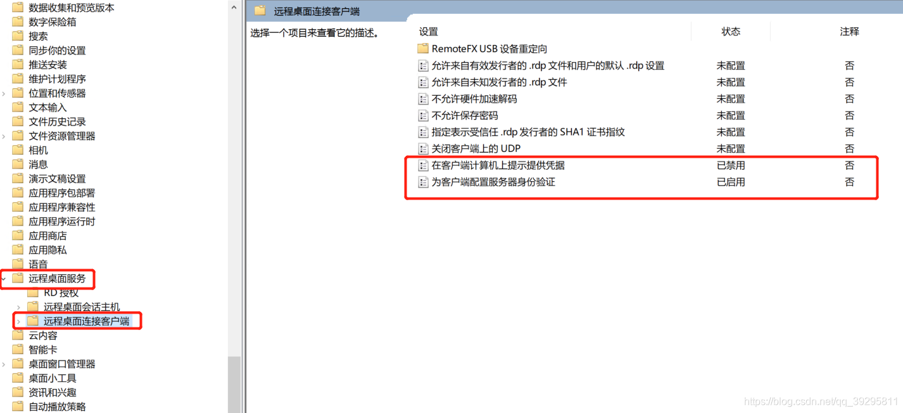

# RDP 连接后输密码

为防止服务器爆破式登录，可以做如下操作，要求先用mstsc方式打开远程桌面窗口后输入账号密码后才能登录。效果如下图：  
  
首先 gpedit.msc 打开组策略  
计算机配置->Windows设置->安全设置->账户策略->账户锁定策略  
账户锁定时间： 根据需求修改  
账户锁定阈值： 根据需求修改  
重置账户锁定计数器： 根据需求修改  

计算机配置->Windows设置->安全设置->本地策略->安全选项  
关机：允许系统在未登录的情况下关闭 **已禁用**  
交互式登录：不显示上次登录 **已启用**  
交互式登录：登录时不显示上次登录 **已启用**  
  
计算机配置->管理模板\->Windows组件->远程桌面服务->远程桌面会话主机->安全  
远程(RDP)连接要求使用指定的安全层 **已启用** RDP  
要求使用网络级别的身份验证对远程连接的用户进行身份验证 **已禁用**  
  
计算机配置->管理模板->Windows组件\->远程桌面服务->远程桌面连接客户端  
在客户端计算机上提示提供凭据 **已禁用**  
为客户端配置服务器身份验证 **已启用**  
  
配置好后  
gpupdate /force 刷新组策略  
之后重新远程连接，会先打开远程桌面，然后再输入账号密码才可以登录主机。
