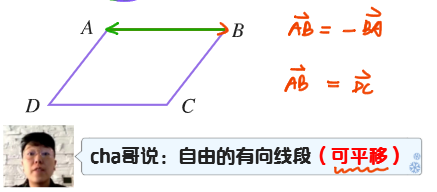
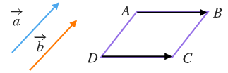
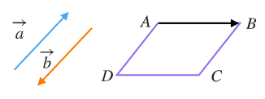
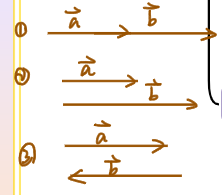

# 【平面向量】平面向量的概念

## 概念

既有**大小**，又有**方向**的量

## 表示

1. 大写字母：$\overrightarrow{AB}$（$A$ 为起点，$B$ 为终点）
   
2. 小写字母：$\overrightarrow{a}$
3. 印刷体：$\symbfit{a}$

## 模

向量 $\overrightarrow{AB}$ 的长度叫做向量 $\overrightarrow{AB}$ 的模，记作 $|\overrightarrow{AB}|$

## 特殊向量

### 单位向量

- 大小：长度为 $1$
- 方向：方向固定，有无数个

### 零向量（ $\overrightarrow{0}$ ）

- 大小：长度为 $0$
- 方向：方向任意，只有 $1$ 个

## 向量的关系

### 相等向量

- 大小**相等**
- 方向**相同**

记作：$\overrightarrow{AB}=\overrightarrow{DC}$

### 相反向量

- 大小**相等**
- 方向**相反**

记作：$\overrightarrow{AB}=-\overrightarrow{CD}$ \
$\overrightarrow{AB}=-\overrightarrow{BA}$

### 共线向量（平行向量）

方向**相同或相反**的**非零**向量

记作：$\overrightarrow{a} // \overrightarrow{b}$

:::tip 规定

$\overrightarrow{0}$ 与任意向量共线

:::
