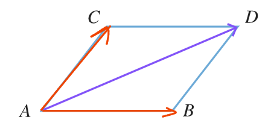

# 【平面向量】平面向量的概念

## 向量的概念

### 概念

既有**大小**，又有**方向**的量

### 表示

1. 大写字母：$\overrightarrow{AB}$（$A$ 为起点，$B$ 为终点）
   
2. 小写字母：$\overrightarrow{a}$
3. 印刷体：$\symbfit{a}$

### 模

向量 $\overrightarrow{AB}$ 的长度叫做向量 $\overrightarrow{AB}$ 的模，记作 $|\overrightarrow{AB}|$

### 特殊向量

#### 单位向量

- 大小：长度为 $1$
- 方向：方向固定，有无数个

#### 零向量（ $\overrightarrow{0}$ ）

- 大小：长度为 $0$
- 方向：方向任意，只有 $1$ 个

### 向量的关系

#### 相等向量

- 大小**相等**
- 方向**相同**

记作：$\overrightarrow{AB}=\overrightarrow{DC}$

#### 相反向量

- 大小**相等**
- 方向**相反**

记作：$\overrightarrow{AB}=-\overrightarrow{CD}$ \
$\overrightarrow{AB}=-\overrightarrow{BA}$

#### 共线向量（平行向量）

方向**相同或相反**的**非零**向量

记作：$\overrightarrow{a} // \overrightarrow{b}$

:::tip 规定

$\overrightarrow{0}$ 与任意向量共线

:::

## 向量的运算

### 向量的加法

#### 法一：三角形法则

$$
\overrightarrow{AB}+\overrightarrow{BC}=\overrightarrow{AC}
$$

$$
\overrightarrow{AC}+\overrightarrow{CB}=\overrightarrow{AB}
$$

:::tip 技巧

特点：中间一样  
口诀：中间一样，连首尾（消消乐）

:::

#### 法二：平行四边形法则

$$
\overrightarrow{AB}+\overrightarrow{AC}=\overrightarrow{AD}
$$

$$
\overrightarrow{BA}+\overrightarrow{BD}=\overrightarrow{BC}
$$

:::tip 技巧

特点：起点一样  
口诀：起点一样，作平四，指对角

:::

### 向量的减法

一个向量减去另一个向量等于加上这个向量的相反向量

$$
\overrightarrow{AB}-\overrightarrow{AC}=\overrightarrow{AB}+\overrightarrow{CA}=\overrightarrow{CA}+\overrightarrow{AB}=\overrightarrow{CB}
$$

$$
\overrightarrow{CA}-\overrightarrow{CB}=\overrightarrow{BA}
$$

:::tip 技巧

特点：起点一样  
口诀：共起点，后指向前

:::

:::tip
换起点，用减法

把 $\overrightarrow{MN}$ 换成以 $A$ 为起点的 $\overrightarrow{AN}-\overrightarrow{AM}$
:::
